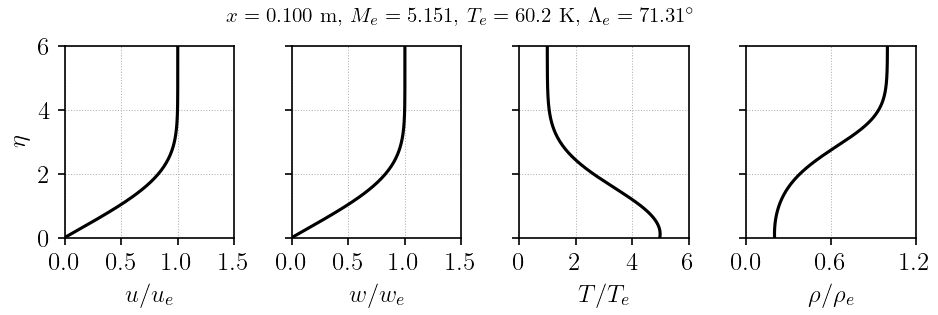
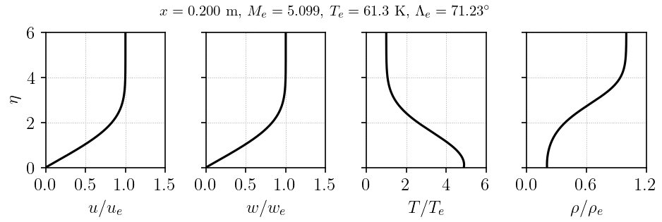
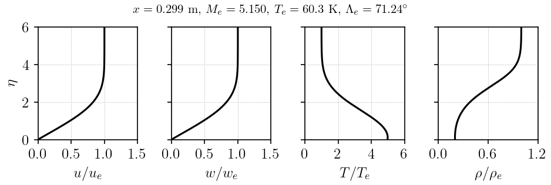
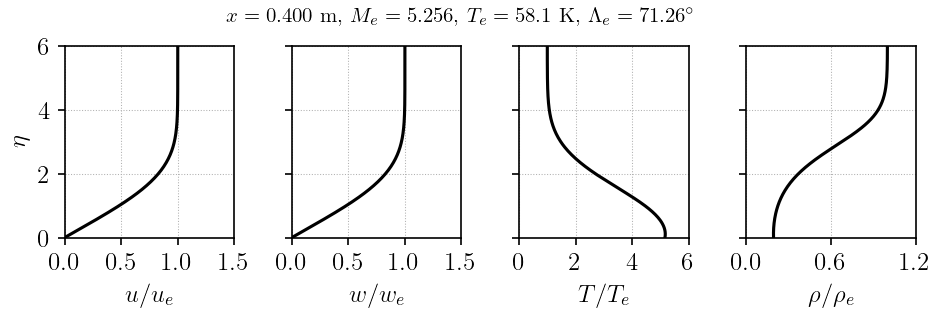
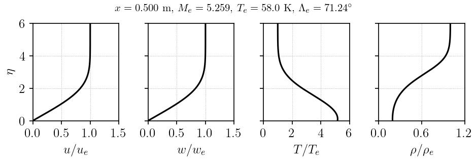
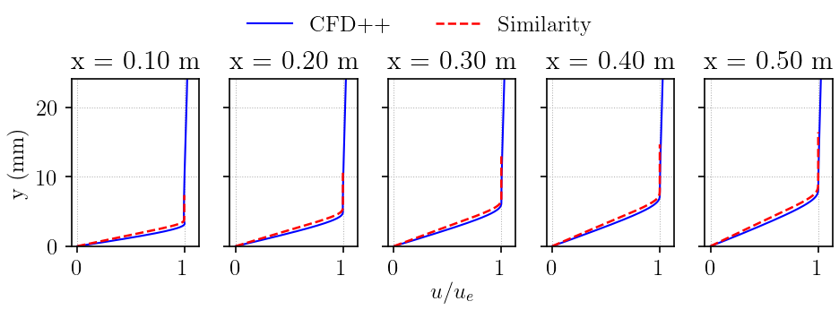
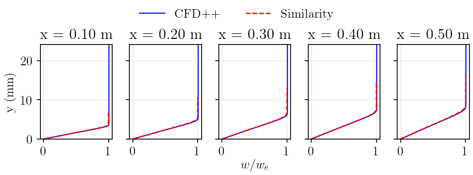
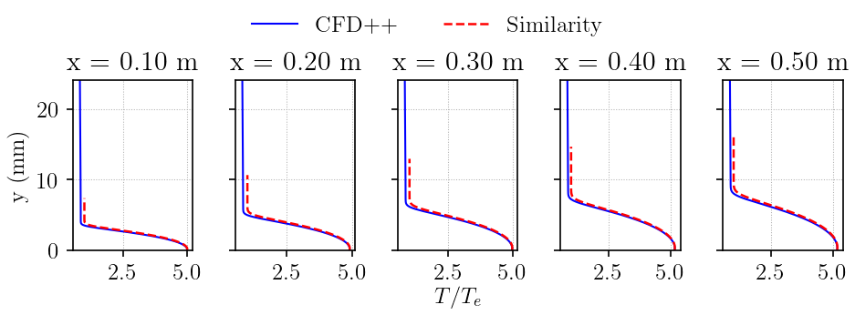
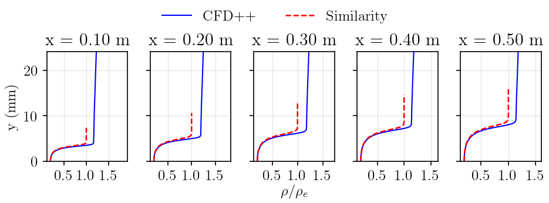

# Swept flat plate, Mach 6, 70 degree sweep

Validation of the Falkner-Skan-Cooke similarity solver against a CFD++ laminar
baseflow for a swept flat plate at Mach 6 with an isothermal wall.

## Flow Conditions

| Parameter | Value |
|---|---|
| Mach number | 6.0 |
| Unit Reynolds number Re1 | 10.0e6 1/m |
| Freestream temperature | 45.73 K |
| Wall temperature | 300 K |
| Sweep angle | approximately 70 degrees |
| Ratio of specific heats | 1.4 |
| Prandtl number | 0.71 |
| Viscosity law | Sutherland |

## Validation Approach

The Falkner-Skan-Cooke similarity solution is compared against wall-normal
profiles extracted from the CFD++ laminar baseflow at five streamwise stations:
x = 0.1, 0.2, 0.3, 0.4, 0.5 m.

At each station, local CFD edge conditions are extracted where the spanwise
velocity reaches 99 percent of the freestream spanwise velocity,
$0.99w_{\infty}$. The local edge Mach number and sweep angle are passed to the FSC
solver. A separate locally self-similar solution is computed at each station
because the edge conditions vary with streamwise location. This treats each
station as a local similarity problem; it does not fully model the non-similar
streamwise evolution of the CFD boundary layer. Similarity profiles are mapped
back to physical y-space using the
[Illingworth-Stewartson inverse transform](../../../../theory/similarity_to_physical_coordinate_transform/illingworth_stewartson.md).

## Results

### Similarity profiles in eta-space

=== "x = 0.100 m"

    

=== "x = 0.200 m"

    

=== "x = 0.299 m"

    

=== "x = 0.400 m"

    

=== "x = 0.500 m"

    

### Rescaled profiles in physical y-space

=== "$u/u_e$"

    

=== "$w/w_e$"

    

=== "$T/T_e$"

    

=== "$\rho/\rho_e$"

    

The streamwise, spanwise, temperature, and density profiles show reasonable agreement
between the Falkner-Skan-Cooke similarity solution and the CFD++ solution for the provided stations.

## Reproduce

Scripts and data are provided in
[`vnv/validation/falkner_skan_cooke/swept_flat_plate_mach_06pt00_re1_10pt00e6_sweep_70deg/`](https://github.com/uahypersonics/similarity-bl/tree/main/vnv/validation/falkner_skan_cooke/swept_flat_plate_mach_06pt00_re1_10pt00e6_sweep_70deg):

```bash
cd vnv/validation/falkner_skan_cooke/swept_flat_plate_mach_06pt00_re1_10pt00e6_sweep_70deg
python scripts/validate.py
```
