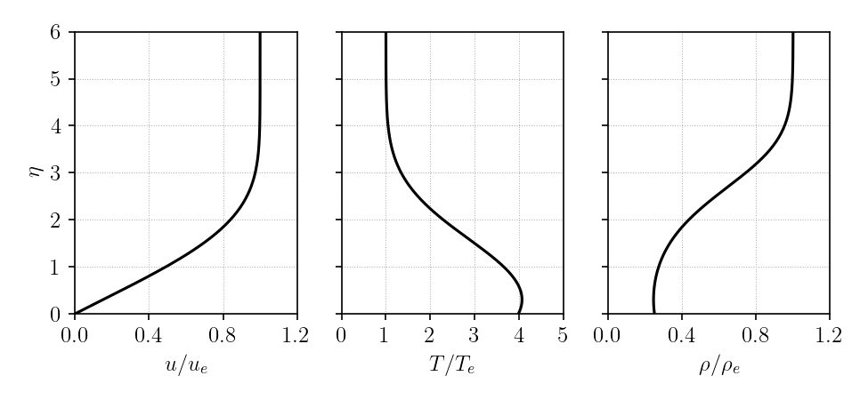
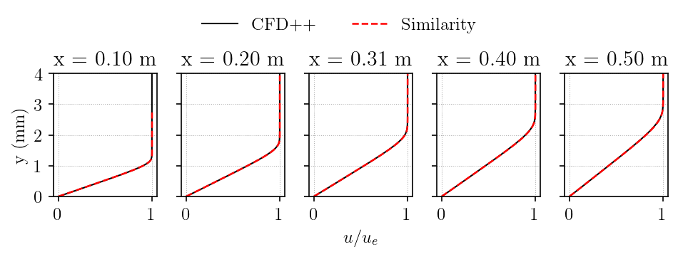
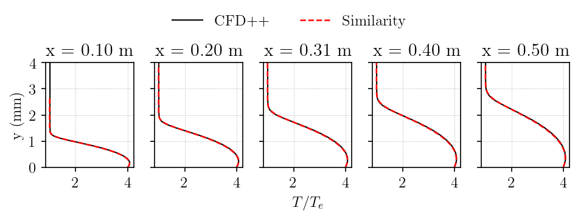
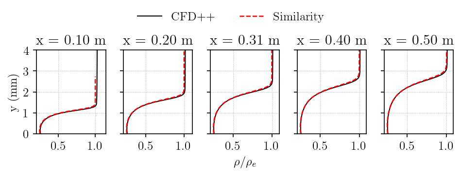

# Sharp flat plate, Mach 5, isothermal wall

Validation of the Falkner-Skan similarity solver against a CFD++ laminar baseflow
for a sharp flat plate at Mach 5 with an isothermal wall.

## Flow Conditions

| Parameter | Value |
|---|---|
| Mach number | 5.0 |
| Unit Reynolds number Re1 | 11.4e6 1/m |
| Freestream temperature | 75.33 K |
| Wall temperature | 300 K |
| Ratio of specific heats | 1.4 |
| Prandtl number | 0.71 |
| Viscosity law | Sutherland |

## Validation Approach

The Falkner-Skan (2D, zero pressure gradient) similarity solution is compared
against wall-normal profiles extracted from the CFD++ RANS baseflow at five
streamwise stations: x = 0.1, 0.2, 0.3, 0.4, 0.5 m.

The similarity profiles are mapped to physical space using the Levy-Lees
transformation for a flat plate (m = 0).

## Results

### Similarity profiles in eta-space



### Streamwise velocity u/u_e



### Temperature T/T_e



### Density rho/rho_e



The velocity and temperature profiles show close agreement between the
Falkner-Skan similarity solution and the CFD++ RANS solution across all five
stations. The small deviation in density is expected: the similarity solution
assumes constant pressure, while the CFD++ solution has a weak streamwise
pressure gradient.

## Reproduce

Scripts and data are in
[`vnv/sharp_flat_plate_mach_05pt00_re1_11pt40e6_isothermal_tw_300_k/`](https://github.com/uahypersonics/similarity-bl/tree/main/vnv/sharp_flat_plate_mach_05pt00_re1_11pt40e6_isothermal_tw_300_k):

```bash
cd vnv/sharp_flat_plate_mach_05pt00_re1_11pt40e6_isothermal_tw_300_k
python scripts/validate.py
```
