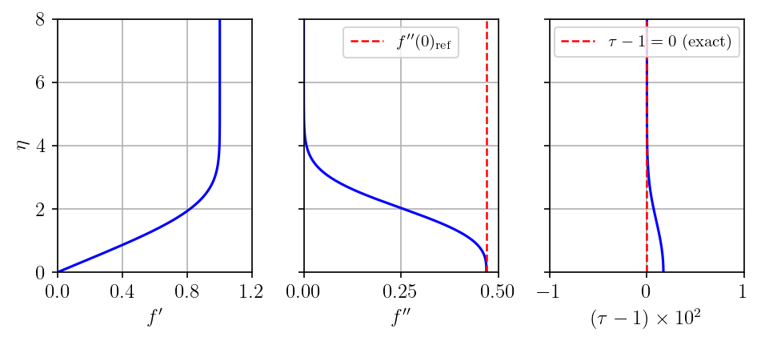
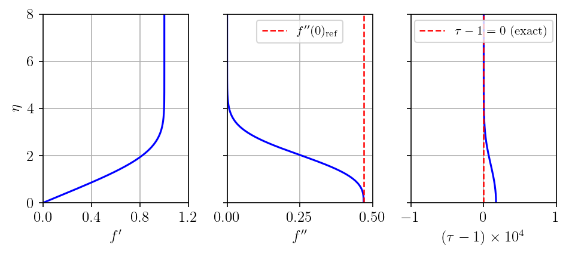
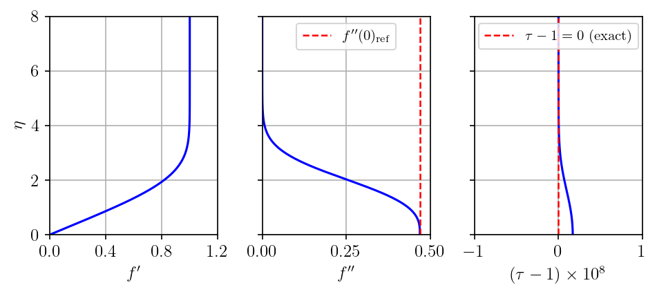
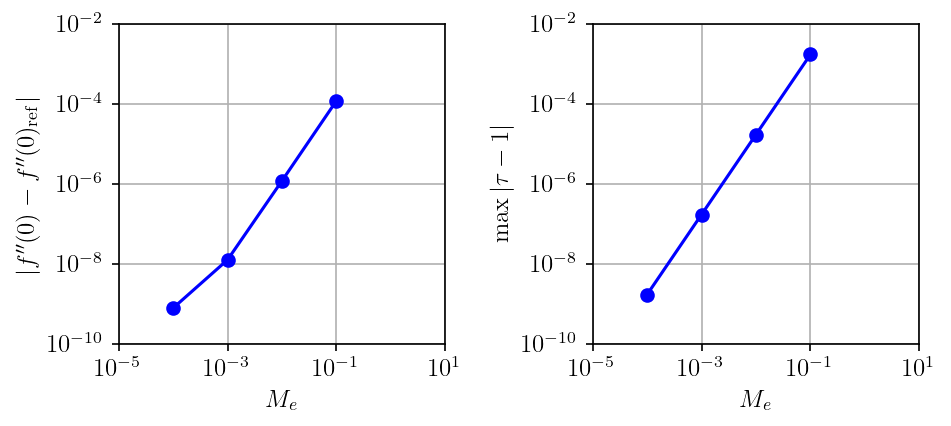

# Blasius limit

At $M_e \to 0$, adiabatic wall, $\beta = 0$ (flat plate), the compressible
Falkner-Skan system reduces to the classical incompressible Blasius equation:

$$
f''' + \tfrac{1}{2} f f'' = 0
$$

The expected wall shear in the Levy-Lees non-dimensionalization is
$f''(0) = 0.4696$.

??? details "Why is the Levy-Lees value 0.4696, not the Blasius value 0.3321?"

    The [Levy-Lees similarity coordinates](../../../theory/falkner_skan/index.md)
    are defined as:

    $$
    \xi = \int_0^x \rho_e \mu_e u_e\,dx',
    \qquad
    \eta = \frac{u_e}{\sqrt{2\xi}} \int_0^y \rho\,dy'
    $$

    For a flat plate with uniform edge conditions $\xi = \rho_e \mu_e u_e x$,
    so $\sqrt{2\xi} = \sqrt{2\rho_e \mu_e u_e x}$ and the wall-normal coordinate
    becomes:

    $$
    \eta_{LL} = \frac{u_e}{\sqrt{2\rho_e \mu_e u_e x}} \int_0^y \rho\,dy'
    $$

    At $M_e \to 0$, $\rho \to \rho_e$, so the integral reduces to $\rho_e y$:

    $$
    \eta_{LL} = \frac{u_e \rho_e}{\sqrt{2\rho_e \mu_e u_e x}}\,y
             = \sqrt{\frac{\rho_e u_e}{2\mu_e x}}\,y
             = \frac{1}{\sqrt{2}}\underbrace{\sqrt{\frac{u_e}{\nu x}}\,y}_{\eta_{Blasius}}
    $$

    where $\nu = \mu_e/\rho_e$.  So:

    $$
    \eta_{LL} = \frac{1}{\sqrt{2}}\,\eta_{Blasius}
    \qquad \Longleftrightarrow \qquad
    \eta_{Blasius} = \sqrt{2}\,\eta_{LL}
    $$

    Both systems describe the same physical velocity ratio $u/u_e = f'$, so
    the two stream functions are related by:

    $$
    f'_{LL}(\eta_{LL}) = f'_{Blasius}(\eta_{Blasius}) = f'_{Blasius}(\sqrt{2}\,\eta_{LL})
    $$

    Differentiating both sides with respect to $\eta_{LL}$ via the chain rule:

    $$
    f''_{LL}(\eta_{LL}) = \sqrt{2}\,f''_{Blasius}(\sqrt{2}\,\eta_{LL})
    $$

    Evaluating at the wall ($\eta_{LL} = 0$):

    $$
    f''_{LL}(0) = \sqrt{2}\,f''_{Blasius}(0) = \sqrt{2} \times 0.33206 \approx 0.4696
    $$

At $M_e \to 0$, adiabatic wall, $\tau = T/T_e \approx 1$ everywhere.

## Results

Profiles of $f'(\eta)$, $f''(\eta)$, and $(\tau - 1) \times 10^n$ (scaled so the
deviation is $O(1)$). Dashed lines mark $f''(0)_\text{ref} = 0.4696$ and $\tau - 1 = 0$.

=== "$M_e = 0.1$"

    

=== "$M_e = 0.01$"

    

=== "$M_e = 0.001$"

    

=== "$M_e = 0.0001$"

    

Both $|f''(0) - f''(0)_\text{ref}|$ and $\max|\tau - 1|$ converge to zero as $M_e \to 0$:



!!! success ""

    Both errors converge monotonically to zero as $M_e \to 0$, confirming that
    the solver correctly recovers the Blasius solution in the incompressible limit.

## Run

The verification script is
[`vnv/verification/falkner_skan/blasius/verification_blasius.py`](https://github.com/uahypersonics/similarity-bl/blob/main/vnv/verification/falkner_skan/blasius/verification_blasius.py).

```bash
python verification_blasius.py
```
