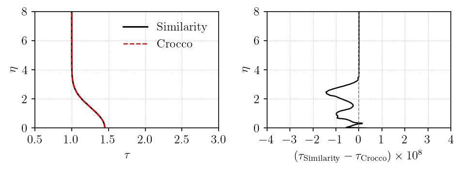
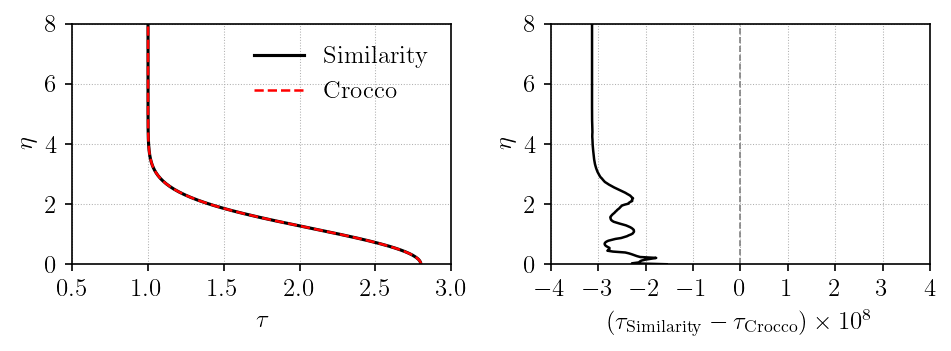

# Crocco relation

## Assumptions

- $\Pr = \frac{\mu c_p}{k} = 1$
- adiabatic wall $\frac{\partial T}{\partial y} = 0$
- zero pressure gradient: $\beta = 0$, therefore $m = 0$ and $u_e$ is constant

## Relation

$$
\tau(\eta) = 1 + \frac{\gamma - 1}{2} M_e^2 \left(1 - f'^{\,2}\right)
$$

??? details "Derivation"

    **Step 1: Start from the 2D compressible boundary layer energy equation**

    The [2D compressible boundary layer equations](../../../theory/boundary_layer_equations/2d_equations.md)
    give the energy equation:

    $$
    \rho c_p \left( u \frac{\partial T}{\partial x} + v \frac{\partial T}{\partial y} \right)
    = u \frac{dp}{dx}
    + \frac{\partial}{\partial y}\!\left( k \frac{\partial T}{\partial y} \right)
    + \mu \left(\frac{\partial u}{\partial y}\right)^{\!2}
    $$

    **Step 2: Eliminate the pressure term**

    Define $H = c_p T + u^2/2$.  The pressure term $u\,dp/dx$ in the energy
    equation has no counterpart in a clean transport form, so we eliminate it
    by adding the $x$-momentum equation multiplied by $u$:

    Multiply the $x$-momentum equation by $u$:

    $$
    \rho \left( u \frac{\partial (u^2/2)}{\partial x} + v \frac{\partial (u^2/2)}{\partial y} \right)
    = -u\frac{dp}{dx} + u\frac{\partial}{\partial y}\!\left( \mu \frac{\partial u}{\partial y} \right)
    $$

    Add this to the energy equation:

    $$
    \begin{aligned}
    \rho \left( u \frac{\partial (c_p T + u^2/2)}{\partial x}
    + v \frac{\partial (c_p T + u^2/2)}{\partial y} \right)
    &= \underbrace{u\frac{dp}{dx} - u\frac{dp}{dx}}_{= \, 0} \\
    &\quad + \frac{\partial}{\partial y}\!\left( k \frac{\partial T}{\partial y} \right)
    + u\frac{\partial}{\partial y}\!\left( \mu \frac{\partial u}{\partial y} \right)
    + \mu \left(\frac{\partial u}{\partial y}\right)^{\!2}
    \end{aligned}
    $$

    The pressure terms cancel exactly.  The left-hand side is simply $\rho(u\,\partial H/\partial x + v\,\partial H/\partial y)$.

    For the right-hand side, the product rule gives:

    $$
    u\frac{\partial}{\partial y}\!\left( \mu \frac{\partial u}{\partial y} \right)
    + \mu \left(\frac{\partial u}{\partial y}\right)^{\!2}
    = \frac{\partial}{\partial y}\!\left( \mu u \frac{\partial u}{\partial y} \right)
    = \frac{\partial}{\partial y}\!\left( \mu \frac{\partial (u^2/2)}{\partial y} \right)
    $$

    After cancellation the equation reads:

    $$
    \rho \left( u \frac{\partial H}{\partial x} + v \frac{\partial H}{\partial y} \right)
    = \frac{\partial}{\partial y}\!\left( k \frac{\partial T}{\partial y} \right)
    + \frac{\partial}{\partial y}\!\left( \mu \frac{\partial (u^2/2)}{\partial y} \right)
    $$

    **Step 3: Require Pr = 1**

    With $\Pr = 1$, thermal conductivity satisfies $k = \mu c_p$.  The two
    remaining terms on the right combine into a single flux of $H$:

    $$
    \frac{\partial}{\partial y}\!\left( k \frac{\partial T}{\partial y} \right)
    + \frac{\partial}{\partial y}\!\left( \mu \frac{\partial (u^2/2)}{\partial y} \right)
    = \frac{\partial}{\partial y}\!\left( \mu c_p \frac{\partial T}{\partial y}
      + \mu \frac{\partial (u^2/2)}{\partial y} \right)
    = \frac{\partial}{\partial y}\!\left( \mu \frac{\partial H}{\partial y} \right)
    $$

    The result is a source-free transport equation for $H$:

    $$
    \rho u \frac{\partial H}{\partial x} + \rho v \frac{\partial H}{\partial y}
    = \frac{\partial}{\partial y}\!\left(\mu \frac{\partial H}{\partial y}\right)
    $$

    Because the right-hand side contains no forcing term, a spatially uniform
    $H$ is always a valid solution, provided the boundary conditions allow it.

    **Step 4: Apply the boundary conditions**

    The wall-normal derivative of $H$ is:

    $$
    \frac{\partial H}{\partial y} = c_p \frac{\partial T}{\partial y}
                                  + u \frac{\partial u}{\partial y}
    $$

    At the wall both terms vanish independently:

    - **No-slip**: $u_w = 0$, so $u_w\,\partial u/\partial y|_w = 0$ regardless
      of the velocity gradient.
    - **Adiabatic**: $\partial T/\partial y|_w = 0$ (zero heat flux by definition).

    Therefore $\partial H/\partial y|_w = 0$, a homogeneous Neumann condition.
    At the boundary-layer edge, $H = H_e = c_p T_e + u_e^2/2$ (Dirichlet).

    **Step 5: Identify the exact solution**

    The $H$-equation has no source term, and the zero-pressure-gradient case
    has a constant edge state.  Since $m = 0$, $u_e$ is constant, so
    $H_e = c_p T_e + u_e^2/2$ is constant as well.  If $H$ is constant, all
    derivatives of $H$ vanish, so the transport equation is satisfied.  The
    edge condition fixes that constant:

    $$H = H_e$$

    Substituting the definitions of $H$ and $H_e$ gives total enthalpy
    conservation across the boundary layer:

    $$c_p T + \tfrac{1}{2}u^2 = c_p T_e + \tfrac{1}{2}u_e^2$$

    This is the key result: the total enthalpy is the edge total enthalpy at
    every $\eta$.

    **Step 6: Non-dimensionalise**

    Divide by $c_p T_e$, use $u_e^2/(2 c_p T_e) = (\gamma - 1)M_e^2/2$, and
    identify $T/T_e = \tau$ and $u/u_e = f'$:

    $$
    \overbrace{\frac{T}{T_e}}^{\tau}
    = 1 + \frac{\gamma - 1}{2} M_e^2
      \left(1 - \overbrace{\frac{u^2}{u_e^2}}^{f'^{\,2}}\right)
    $$

    Therefore:

    $$
    \boxed{
    	\tau(\eta) = 1 + \frac{\gamma - 1}{2} M_e^2 \left(1 - f'^{\,2}\right)
    }
    $$

    This is the Crocco relation used in the verification.  It requires
    $\Pr = 1$ and the zero-pressure-gradient case tested here.

## Results

This holds for any $M_e$ when $\beta = 0$. Two cases are tested:

| Case | $M_e$ | $m$ | $\beta$ |
|---|---|---|---|
| A | 1.5 | 0 | 0.0 |
| B | 3.0 | 0 | 0.0 |

=== "$M_e = 1.5$"

    

=== "$M_e = 3.0$"

    

!!! success ""

    The similarity solution and Crocco relation agree well for both Mach numbers.

## Run

The verification script is
[`vnv/verification/falkner_skan/crocco/verification_crocco.py`](https://github.com/uahypersonics/similarity-bl/blob/main/vnv/verification/falkner_skan/crocco/verification_crocco.py).

```bash
python verification_crocco.py
```
