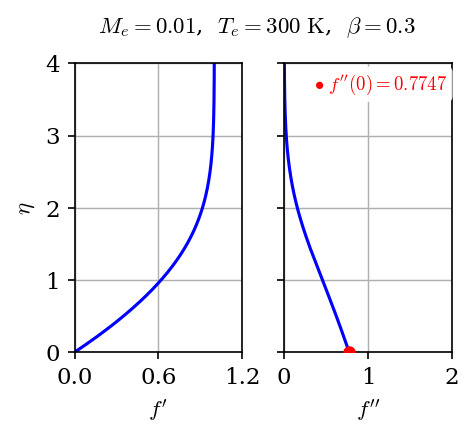
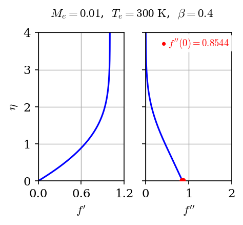
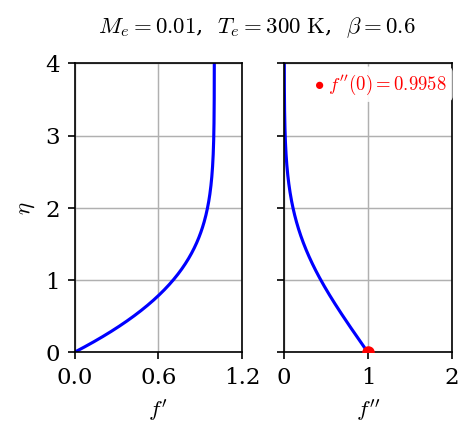
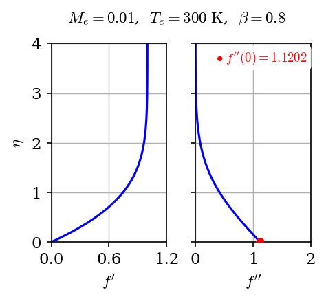
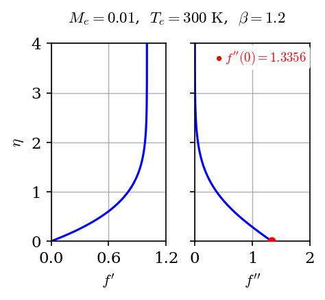
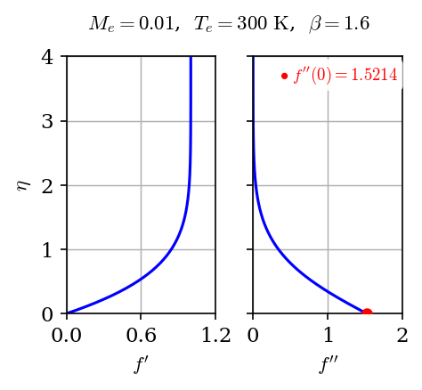
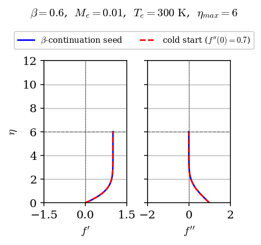
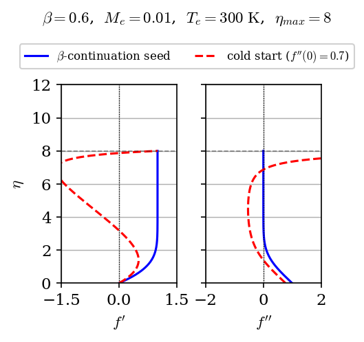
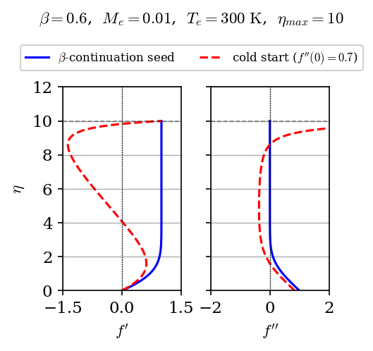
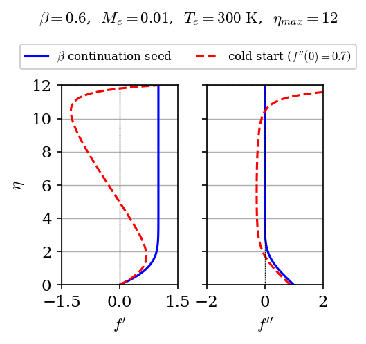

# Hartree (1937) wall shear

Sweeps $\beta \in \{0.3,\, 0.4,\, 0.6,\, 0.8,\, 1.2,\, 1.6\}$ at
$M_e = 0.01$, adiabatic wall, and compares $f''(0)$ against the tabulated
values from Hartree (1937)[^1].

## Incompressible approximation

The compressible solver is run at $M_e = 0.01$ with an adiabatic wall.
At this Mach number $T \approx T_e$ throughout the boundary layer, so
$\mu/\mu_e \to 1$ and the compressible equations reduce to the
incompressible Falkner-Skan system solved by Hartree.
The [Blasius limit](../blasius.md) case shows that the solver converges
toward the incompressible solution as $M_e \to 0$.

| Parameter | Value |
|---|---|
| $M_e$ | 0.01 |
| $T_e$ | 300 K |
| Wall BC | adiabatic |

## Results

$f'(\eta)$ and $f''(\eta)$ profiles at each $\beta$. The red dot marks $f''(0)$
at the wall.

=== "$\beta = 0.3$"

    

=== "$\beta = 0.4$"

    

=== "$\beta = 0.6$"

    

=== "$\beta = 0.8$"

    

=== "$\beta = 1.2$"

    

=== "$\beta = 1.6$"

    

| $\beta$ | $f''(0)$ Hartree (1937)[^1] | $f''(0)$ solver | rel. err. (%) |
|---|---|---|---|
| 0.3 | 0.7745 | 0.77474 | 0.032 |
| 0.4 | 0.854  | 0.85440 | 0.047 |
| 0.6 | 0.995  | 0.99580 | 0.080 |
| 0.8 | 1.121  | 1.12021 | 0.071 |
| 1.2 | 1.335  | 1.33562 | 0.046 |
| 1.6 | 1.522  | 1.52137 | 0.041 |

[^1]: D. R. Hartree, "On an equation occurring in Falkner and Skan's approximate treatment of the equations of the boundary layer," *Mathematical Proceedings of the Cambridge Philosophical Society*, vol. 33, no. 2, pp. 223–239, 1937.

## Sensitivity to initial guess and $\eta_{max}$

Convergence can be sensitive to the initial guess and the domain height $\eta_\text{max}$. This is demonstrated at $\beta = 0.6$ by varying both parameters using two different initialization methods.

| Method | Description |
|---|---|
| Cold start | Default initial guess: $f''(0) = 0.7$, $g = 1$ |
| $\beta$-continuation seed | Solve at a smaller $\beta$ (milder pressure gradient), then step toward the target $\beta$, using each converged result as the initial guess for the next step |

=== "$\eta_{max} = 6$"

    

=== "$\eta_{max} = 8$"

    

=== "$\eta_{max} = 10$"

    

=== "$\eta_{max} = 12$"

    

For $\eta_\text{max} \geq 8$ the cold start leads to a spurious profile that happens to fulfill the boundary conditions exactly but clearly does not reach an asymptotic freestream. The continuation seed continues to converge to the correct profile.

## Run

The verification script is
[`vnv/verification/falkner_skan/hartree/verification_hartree.py`](https://github.com/uahypersonics/similarity-bl/blob/main/vnv/verification/falkner_skan/hartree/verification_hartree.py).

```bash
python vnv/verification/falkner_skan/hartree/verification_hartree.py
```

The initial-guess sensitivity figures are generated by
[`vnv/verification/falkner_skan/hartree/initial_guess_sensitivity_beta_0pt6.py`](https://github.com/uahypersonics/similarity-bl/blob/main/vnv/verification/falkner_skan/hartree/initial_guess_sensitivity_beta_0pt6.py).

```bash
python vnv/verification/falkner_skan/hartree/initial_guess_sensitivity_beta_0pt6.py
```
