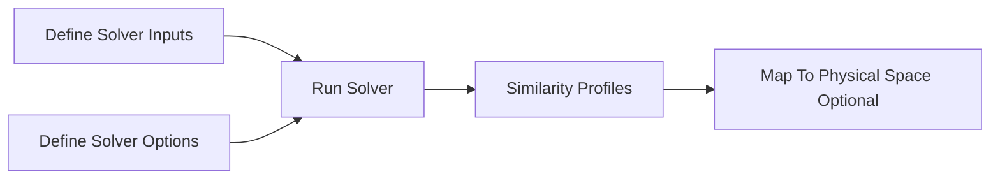

# Workflow

`simbl` supports a compact local similarity workflow: define the problem inputs,
choose solver options, run the solver, and optionally map the result to physical
space.

This page summarizes the main steps and outputs. For
runnable examples, use [CLI Usage](../user_guide/cli_usage.md),
[API Usage](../user_guide/api_usage.md), or
[MATLAB Usage](../user_guide/matlab_usage.md).

## Schematic

## Workflow Steps

1. [Define Solver Inputs](define_solver_inputs.md)
2. [Define Solver Options](define_solver_options.md)
3. [Run Solver](run_solver.md)
4. [Optionally Map To Physical Space](map_to_physical_space.md)
5. [Use Or Export Profiles](use_or_export_profiles.md)
